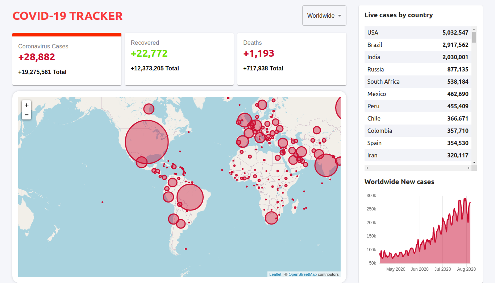

# COVID-19 TRACKER

> In this project I build a [COVID-19](https://covid19.who.int/) tracker application which shows Corona virus cases, deaths and recovery throughout the world. The project support map preview of the pandamic includes around 214 countries of the world.

## Live Demo

[Open Live Demo](https://covid-19-tracker-48afd.web.app/)

## Built With

- reactjs
- Backend COVID-19 API

## 🛠 Setup configurations

To get this app ready to run, follow this steps:

* Clone this repo

        pc:~$ git clone https://github.com/keddo/covid-19-tracker.git

* Change your directory to the app folder

        pc:~$ cd covid-19-tracker/

* Install required packages

        pc:~$ npm install
    
## How to use it

Once you have the required packages. 
* Run the following command on your terminal
   > pc$ npm start
## Authors

👤 **Kedir Abdurahman**
- Github: [@keddo](https://github.com/keddo)
- Twitter: [@kedirman](https://twitter.com/kedirman)
- Linkedin: [Kedir Abdurahman](https://linkedin.com/in/kedirabdurahman/)

## 🤝 Contributing

Contributions, issues and feature requests are welcome!

Feel free to check the [issues page](https://github.com/keddo/covid-19-tracker/issues/1).

## 👍 Show your support

Give a ⭐️ if you like this project!

## 📝 License

This project is free to use as learning purposes. For any external content (e.g. logo, images, ...), please contact the proper author and check their license of use.